# Sistema de Gestión de Reparaciones

## Usuarios del Sistema

### 1. Administrador
- Gestión completa de usuarios
- Acceso a todos los módulos
- Supervisión de operaciones

### 2. Técnicos Especializados
#### 2.1 Técnico de Accesorios
- Reparación de smartphones y tablets
- Cambio de pantallas
- Reparación de baterías
- Servicio de accesorios (cargadores, auriculares)
- Gestión de inventario de accesorios

#### 2.2 Técnico de Laptops
- Reparación de portátiles
- Diagnóstico de hardware
- Cambio de componentes internos
- Reparación de teclados y pantallas
- Gestión de inventario de componentes para laptops

#### 2.3 Técnico de PC
- Ensamblaje de computadoras
- Reparación de componentes de escritorio
- Diagnóstico de hardware
- Optimización de sistemas
- Gestión de inventario de componentes para PC

### 3. Auxiliar
- Recepción de equipos
- Atención al cliente
- Gestión de citas
- Seguimiento de reparaciones

### 4. Invitado
- Consulta de estado de reparaciones
- Información general

## Módulos Creados

### 1. Panel de Administración de Usuarios
- CRUD de usuarios
- Asignación de roles
- Gestión de permisos

### 2. Panel de Técnicos
#### 2.1 Panel de Técnico de Accesorios
- Gestión de reparaciones de smartphones y tablets
- Inventario de accesorios y repuestos
- Historial de servicios de accesorios
- Calendario de trabajo específico
- Comunicación con clientes

#### 2.2 Panel de Técnico de Laptops
- Gestión de reparaciones de portátiles
- Inventario de componentes para laptops
- Historial de servicios de laptops
- Calendario de trabajo específico
- Comunicación con clientes

#### 2.3 Panel de Técnico de PC
- Gestión de reparaciones de computadoras
- Inventario de componentes para PC
- Historial de servicios de PC
- Calendario de trabajo específico
- Comunicación con clientes

## Módulos del Usuario Auxiliar

1. **Recepción de Equipos**
   - Registro de equipos que ingresan al taller.
   - Asignación de número de orden y datos del cliente.
   - Diferencia: Exclusivo del auxiliar, no disponible para técnicos.

2. **Seguimiento de Órdenes**
   - Visualización de todas las órdenes activas.
   - Actualización de estados administrativos (recibido, en espera de técnico, listo para entrega).
   - Diferencia: El auxiliar no puede editar diagnósticos ni presupuestos, solo estados administrativos.

3. **Entrega de Equipos**
   - Registro de la entrega del equipo al cliente.
   - Confirmación de pago y generación de comprobante.
   - Diferencia: Proceso administrativo, no técnico.

4. **Comunicación con Clientes**
   - Envío de mensajes predefinidos sobre recepción, avance administrativo y entrega.
   - Diferencia: Solo acceso a plantillas administrativas, no técnicas.

5. **Inventario Básico**
   - Consulta rápida de stock de repuestos y accesorios.
   - Solicitud de reposición al técnico o administrador.
   - Diferencia: Solo consulta y solicitud, no gestión ni edición de stock.

6. **Historial de Servicios**
   - Consulta general de reparaciones pasadas por cliente, equipo o fecha.
   - Diferencia: Solo vista general, sin acceso a detalles técnicos.

7. **Caja y Pagos**
   - Registro de pagos recibidos y generación de recibos.
   - Consulta de movimientos diarios.
   - Diferencia: Exclusivo del auxiliar, no disponible para técnicos.

---

### Diagrama de Acceso a Módulos (Actualizado)

```mermaid
graph TD;
  Admin[Administrador]
  Auxiliar[Auxiliar]
  TecnicoAcc[Técnico Accesorios]
  TecnicoLap[Técnico Laptops]
  TecnicoPC[Técnico PC]

  subgraph Modulos
    Recepcion[Recepción de Equipos]
    Seguimiento[Seguimiento de Órdenes]
    Entrega[Entrega de Equipos]
    ComAdmin[Comunicación Administrativa]
    InventarioBasico[Inventario Básico]
    HistorialGeneral[Historial General]
    CajaPagos[Caja y Pagos]
    Reparaciones[Gestión de Reparaciones]
    InventarioTec[Inventario Técnico]
    HistorialTec[Historial Técnico]
    Ensamblaje[Ensamblaje de PCs]
    ComTec[Comunicación Técnica]
  end

  Admin -- Acceso total --> Recepcion
  Admin -- Acceso total --> Seguimiento
  Admin -- Acceso total --> Entrega
  Admin -- Acceso total --> ComAdmin
  Admin -- Acceso total --> InventarioBasico
  Admin -- Acceso total --> HistorialGeneral
  Admin -- Acceso total --> CajaPagos
  Admin -- Acceso total --> Reparaciones
  Admin -- Acceso total --> InventarioTec
  Admin -- Acceso total --> HistorialTec
  Admin -- Acceso total --> Ensamblaje
  Admin -- Acceso total --> ComTec

  Auxiliar -- Solo administrativo --> Recepcion
  Auxiliar -- Solo administrativo --> Seguimiento
  Auxiliar -- Solo administrativo --> Entrega
  Auxiliar -- Solo administrativo --> ComAdmin
  Auxiliar -- Consulta/solicitud --> InventarioBasico
  Auxiliar -- Consulta general --> HistorialGeneral
  Auxiliar -- Acceso --> CajaPagos

  TecnicoAcc -- Solo técnico --> Reparaciones
  TecnicoAcc -- Solo técnico --> InventarioTec
  TecnicoAcc -- Solo técnico --> HistorialTec
  TecnicoAcc -- Solo técnico --> ComTec

  TecnicoLap -- Solo técnico --> Reparaciones
  TecnicoLap -- Solo técnico --> InventarioTec
  TecnicoLap -- Solo técnico --> HistorialTec
  TecnicoLap -- Solo técnico --> ComTec

  TecnicoPC -- Solo técnico --> Reparaciones
  TecnicoPC -- Solo técnico --> InventarioTec
  TecnicoPC -- Solo técnico --> HistorialTec
  TecnicoPC -- Solo técnico --> Ensamblaje
  TecnicoPC -- Solo técnico --> ComTec
``` 

---

## Revisión Global y Detalles Clave para el MER

### Usuarios y Roles
- **Administrador:** Acceso total a todos los módulos, puede gestionar usuarios, inventario, historial, órdenes y supervisar la comunicación.
- **Auxiliar:** Encargado de la recepción, seguimiento administrativo, entrega, comunicación administrativa, consulta de inventario y caja/pagos. Relación directa con técnicos y clientes.
- **Técnicos (Accesorios, Laptops, PC):** Encargados de la gestión técnica de reparaciones, inventario técnico, historial técnico, ensamblaje (PC), y comunicación técnica con clientes.
- **Invitado:** (No implementado aún) Solo consulta de estado o información general.

### Órdenes de Reparación
- Cada orden tiene:
  - Un auxiliar que la recibe.
  - Uno o varios técnicos asignados (según especialidad).
  - Estados administrativos (recepcionado, en espera, listo para entrega) y técnicos (diagnóstico, en reparación, completado).
  - Fechas de recepción, diagnóstico, reparación, entrega.
  - Relación con el cliente y el equipo.

### Inventario
- **Inventario Técnico:** Gestionado por técnicos, incluye repuestos y componentes específicos.
- **Inventario Básico:** Consultado y solicitado por auxiliares, gestionado por técnicos/admin.
- Las solicitudes de reposición pueden ser iniciadas por auxiliares y aprobadas por técnicos/admin.

### Comunicación
- **Administrativa:** Auxiliar-cliente, solo mensajes administrativos (recepción, avance, entrega).
- **Técnica:** Técnico-cliente, solo mensajes técnicos (diagnóstico, reparación, recomendaciones).
- Ambas comunicaciones pueden estar ligadas a la misma orden y cliente, pero con permisos y plantillas diferentes.

### Historial
- **General:** Consultado por auxiliares y admin, muestra todas las órdenes y servicios.
- **Técnico:** Consultado por técnicos, muestra detalles técnicos y reportes de reparación.
- El historial debe registrar tanto acciones administrativas como técnicas.

### Caja y Pagos
- Módulo exclusivo del auxiliar (y admin), registra pagos, genera recibos y consulta movimientos diarios.
- Relacionado con la entrega de equipos y el cierre de órdenes.

### Relaciones N:M
- Una orden puede requerir la intervención de varios técnicos (por especialidad o complejidad).
- Un técnico puede estar asignado a muchas órdenes.
- Un auxiliar puede recibir muchas órdenes, pero cada orden solo tiene un auxiliar de recepción.

### Modularidad y Permisos
- Los módulos pueden compartir estructura visual, pero los permisos y acciones disponibles dependen del rol.
- Los formularios y vistas deben adaptarse según el usuario (por ejemplo, el auxiliar no puede editar diagnósticos técnicos).

--- 